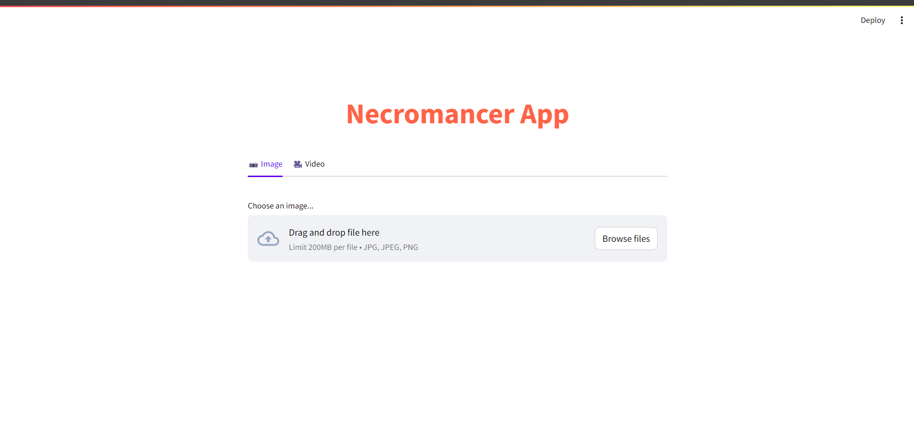

# Image Colorization and Captioning with DeOldify and BLIP

This project combines the power of DeOldify for image colorization and Salesforce's BLIP model for image captioning. It allows you to automatically colorize images and generate captions based on their content.

## Overview

The project focuses on leveraging state-of-the-art AI techniques to enhance visual content through colorization and captioning. By integrating powerful tools like DeOldify for artistic image and video colorization, and Salesforce's BLIP model for generating contextual captions, the project aims to:

Enhance Visual Appeal: Transform black-and-white images and videos into vibrant, colorized versions using advanced neural networks.

Provide Contextual Understanding: Automatically generate descriptive captions for images and videos, enabling users to better understand and appreciate visual content.

Through these capabilities, the project seeks to demonstrate the potential of AI in enriching visual media and providing enhanced user experiences across various applications.
## Files

### 1. `deploy.py`

This script sets up a Streamlit web application for interactive image and video processing. It utilizes DeOldify for image colorization and a pretrained model for image captioning.

### 2. `utilityfunctions.py`

This module contains utility functions used by `deploy.py` for tasks such as:

- **Adding subtitles to frames:** Functions to add text subtitles to individual frames of a video.
  
- **Extracting frames:** Functionality to extract frames from a video file.
  
- **Colorizing frames and generating captions:** Functions to apply colorization to frames and generate captions using AI models.
  
- **Creating video from frames:** Combines frames back into a video file after processing.
  
- **Converting text to audio:** Functions to convert captions to audio files, ensuring minimum durations and handling similarities between captions.

### 3. `setenvironment.ipynb`

This Jupyter Notebook sets up the environment for running the project. It installs necessary Python packages (`transformers`, `pillow`, `torch`, `gTTS`, `moviepy`, `tqdm`) and configures DeOldify for GPU acceleration. It also downloads and initializes the required models for image colorization and captioning.

### 4. `colorize_video.ipynb`

Another Jupyter Notebook that demonstrates how to colorize a video using the DeOldify model and generate captions for the video frames using the image captioning pipeline.

### 5. `README.md`

This file provides an overview of the project, explains each file's role, and outlines how to set up the environment and run the project. It serves as a guide for developers and users to understand and use the project effectively.

## Project Idea

The core idea of the project is to leverage AI capabilities to:

- **Enhance Visual Content:** Colorize black-and-white images and videos using artistic techniques.
  
- **Add Contextual Information:** Automatically generate captions for images and videos to provide meaningful context.

By combining these capabilities, the project aims to create a richer, more engaging experience for users interacting with visual media.

# test using deployment 

